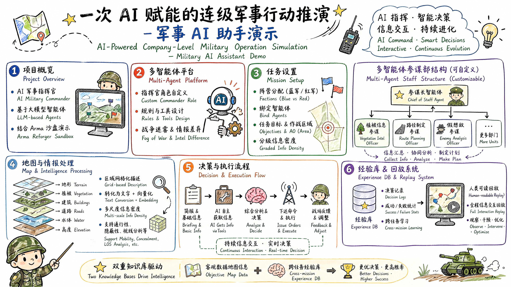

<div align="center">


# OpenArma

**Comandante Militar de IA — una plataforma de multiagentes configurable, con Arma Reforger como primer campo de batalla**

[](https://github.com/chenhaha99/OpenArma/stargazers)
[](https://github.com/chenhaha99/OpenArma/network)
[](https://github.com/chenhaha99/OpenArma/issues)
[](https://github.com/chenhaha99/OpenArma/blob/main/LICENSE)

[Español](#español) | [English](#english)

</div>

---

<a id="español"></a>

<div align="center">

</div>

## ⚡ Resumen del proyecto

Imagina que has diseñado un asistente militar de IA: es difícil demostrar su eficacia haciéndolo librar una guerra real.

OpenArma resuelve este problema conectándose a **Arma Reforger** (un juego con un entorno de sandbox militar), permitiendo que un comandante de IA tome decisiones, emita órdenes y observe los resultados en un entorno táctico real. Puedes controlarlo todo desde arriba, como en un juego de estrategia al estilo "Red Alert", o meterte en la piel de uno de los soldados para vivir en primera persona el mando de la IA.

> Empieza en el campo de batalla, pero no se queda ahí. En su base, OpenArma es una plataforma de multiagentes de propósito general: puedes crear proyectos, configurar agentes, conectar tus propios LLM y diseñar topologías de colaboración multiagente. El mando militar es solo el primer caso de uso.

<div align="center">

▶️ **Video de demostración** | [Bilibili (chino)](https://www.bilibili.com/video/BV1tuRFBUESe) | [YouTube (inglés)](https://www.youtube.com/watch?v=S348nJ6qFfU)

</div>

<div align="center">

🌐 **Demo en línea** | [openarma.com](https://openarma.com) | [Ejemplo de conversación compartida](https://openarma.com/shared/fa508f0d-5786-4c21-84b3-57510f2c1573)

> ⚠️ El servidor de demostración en línea caducará el **20 de mayo de 2026**. A partir de esa fecha, despliega tu propia instancia para probarlo.

</div>

## 🎯 ¿Cómo es una demostración completa de mando con IA?

### 1. Diseña tu comandante de IA

Crea un agente en la interfaz web y asígnale el rol de comandante. Puedes personalizar su system prompt, sus reglas de comportamiento y las herramientas disponibles.

Por ejemplo, en nuestras pruebas descubrimos que, al encontrarse con el enemigo, la IA siempre prioriza pedir un ataque de artillería — como en el estudio de aquel profesor británico, donde la IA usó armas nucleares en 20 de 21 guerras simuladas. La IA ve estas armas como herramientas de altísima eficiencia, no como el "último recurso" que serían para un humano. Por eso podemos limitar mediante reglas el uso de armamento de la IA y guiarla hacia tácticas como el envolvimiento o el flanqueo.

### 2. Configura la conversación y los bandos

Crea una nueva conversación dentro del proyecto y asigna el control de cada bando a la IA o a un humano:

- **IA vs. humano**: la IA comanda un bando y tú controlas el otro
- **IA vs. IA**: dos comandantes de IA independientes se enfrentan, cada uno solo ve la información detectada por su propio reconocimiento (**niebla de guerra**)

También puedes vincular el mismo agente a distintos modelos de lenguaje para que cada uno comande un bando, lo que permite comparar el rendimiento de diferentes modelos en igualdad de condiciones.

Cada conversación requiere definir un **objetivo de misión** y una **zona de operaciones**. El comandante de IA toma todas sus decisiones en función de ese objetivo.

### 3. ¿Cómo percibe la IA el campo de batalla?

Este es uno de los diseños más importantes del proyecto: **en lugar de darle a la IA toda la información de golpe, le damos herramientas para que decida por sí misma qué necesita.**

Al comenzar la misión, la IA recibe un briefing con una visión general básica del terreno y el despliegue de fuerzas. Si quiere saber más:

- ¿Quiere conocer la distribución de edificios en una zona? Llama a una herramienta, indica las coordenadas y obtiene información detallada
- ¿Quiere evaluar el sigilo de una ruta? La herramienta le indica la cobertura vegetal y el grado de ocultación del terreno
- ¿Quiere evaluar una ruta de ataque? La herramienta de planificación de rutas combina transitabilidad, cobertura y pendiente para dar una recomendación

Igual que un comandante real: no lees toda la inteligencia disponible de entrada, sino que la consultas según la necesites.

### 4. El mapa: cómo entiende la IA el mundo

Los humanos son buenos leyendo mapas; la IA es buena leyendo texto. Nuestro enfoque: dividir el mapa en celdas hexagonales, convertir la vegetación, las edificaciones y el relieve de cada celda en descripciones textuales y luego vectorizarlas.

El origen de esta información es muy detallado: la coordenada y el tamaño de cada árbol, la orientación y las dimensiones de cada edificio, el ancho y el trazado de cada carretera. A partir de estos datos brutos, el sistema puede generar:

- **Mapa de densidad vegetal** — dónde hay bosque denso y dónde hay terreno abierto
- **Distribución de edificios** — si es una ciudad o un pueblo, y su valor como posición defensiva
- **Análisis de transitabilidad** — si un tanque puede pasar y cuánto tarda la infantería en recorrer una ruta
- **Evaluación de sigilo** — rutas ocultas para atacar, zonas de cobertura que patrullar al defender
- **Análisis de línea de visión** — hasta dónde se ve desde una colina
- Y más capas temáticas...

### 5. Estado mayor multiagente

Un único comandante de IA haciendo todo el trabajo tiene un alcance limitado. Por eso diseñamos la colaboración multiagente:

Puedes montar un "estado mayor" — por ejemplo, un oficial de inteligencia vegetal que aporta los datos geográficos brutos, un oficial de rutas experto en trazar itinerarios desde varios ángulos, y un oficial de fuerza opuesta que simula los planes probables del enemigo. Cada uno analiza su parte y se la entrega al jefe de estado mayor, que combina toda la información para tomar la decisión final.

La estructura completa del estado mayor es totalmente personalizable: quién discute con quién, cuántas rondas de discusión hay, si se debaten entre sí o informan de forma jerárquica — todo se construye arrastrando elementos en un editor visual de topología DAG.

### 6. Aprender de la experiencia

Al terminar la misión, la IA hace una revisión como lo haría una persona:

- Si la tasa de bajas fue alta, analiza en qué fase las decisiones pudieron haber causado esas bajas
- Si la misión fracasó, registra las causas del fracaso y sus recomendaciones

Estas lecciones se guardan en una base de conocimiento y se vectorizan. En la siguiente misión, la IA puede recuperar lecciones históricas de situaciones similares. La base de experiencia también cuenta cuántas veces tuvo éxito o fracasó cada tipo de decisión — si una táctica falla repetidamente, la IA la evita automáticamente.

**Dos bases de conocimiento**: una de datos objetivos del mapa (obtiene información distinta según el objetivo de cada misión) y otra de experiencia entre misiones (para que la IA aprenda de las lecciones históricas).

## 🚀 Funcionalidades principales

### Capacidades de la plataforma

| Funcionalidad | Descripción |
|:---|:---|
| Colaboración multiagente | Editor visual de topología DAG, flujo de colaboración personalizable (discusión / informe / votación) |
| Base de conocimiento (RAG) | Subida de documentos → vectorización → búsqueda semántica, vinculable a agentes según necesidad |
| Gestión de proveedores de LLM | Usa tu propia API Key, con más de 10 proveedores preconfigurados como DeepSeek / OpenAI / Anthropic / Gemini |
| Llamada a herramientas | Herramientas integradas + integración con servidores MCP; el agente decide de forma autónoma cuándo llamarlas |
| Ramificación de conversaciones | Editar y reenviar, regenerar, navegación por ramas |
| Sistema de recursos | Agentes / bases de conocimiento / topologías — recursos globales, con soporte para privado / público / oficial |
| Vitrina comunitaria | Explora y clona con un clic los recursos públicos |
| Seguimiento de uso | Consumo de tokens, estimación de costes, detalle de llamadas |

### Integración con Arma Reforger

| Funcionalidad | Descripción |
|:---|:---|
| IA vs. humano | La IA comanda un bando y el humano controla el otro |
| IA vs. IA | Dos comandantes de IA independientes, con niebla de guerra |
| Panel de control web | Iniciar/detener, configuración de bandos, intervalo de decisiones — todo desde el navegador |
| Percepción del terreno | Análisis con celdas hexagonales H3, planificación de rutas A*, múltiples capas temáticas |
| Sistema de mapas | Visor por teselas, coordenadas militares de seis dígitos, sombreado de relieve |
| Repetición de combate | Revisión fotograma a fotograma, reconstruyendo toda la misión |

### Repositorios de mods de Arma

| Mod | Descripción | Repositorio |
|:---|:---|:---|
| **OpenArma Mod Main** | Mod principal — runtime del comandante de IA | [GitHub](https://github.com/chenhaha99/OpenArma-Mod-Main) |
| **OpenArma Mod MapExporter** | Exportación de datos de mapa desde Workbench | [GitHub](https://github.com/chenhaha99/OpenArma-Mod-MapExporter) |
| **OpenArma Mod MapScanner** | Escaneo de mapa dentro del juego | [GitHub](https://github.com/chenhaha99/OpenArma-Mod-MapScanner) |

## 🏗️ Arquitectura del sistema

```
┌──────────────────────────────────────────────────────────────────────┐
│                           Frontend Next.js                           │
│  Gestión de proyectos · Conversaciones · Configuración de agentes    │
│  Editor de topología · Base de conocimiento                          │
│  Gestión de LLM · Panel de uso · Administración · i18n · Modo oscuro │
└──────────────────────────┬───────────────────────────────────────────┘
                           │
┌──────────────────────────┴───────────────────────────────────────────┐
│  Backend FastAPI (basado en fba)                                     │
│  Autenticación · Plugins · Tareas asíncronas                         │
│  Streaming SSE · Observabilidad                                      │
├──────────────────────────────────────────────────────────────────────┤
│  Motor de conversación (LangGraph + LiteLLM)                         │
│  Agente único/multiagente · Topología DAG                            │
│  Llamada a herramientas · Búsqueda RAG                               │
├──────────────────────────────────────────────────────────────────────┤
│  Capa de integración con Arma (Open API)                             │
│  Endpoints de mando · Máquina de estados de combate                  │
│  Cola de mensajes · Herramientas de mapa                             │
└──────────────────────────┬───────────────────────────────────────────┘
                           │
┌──────────────────────────┴───────────────────────────────────────────┐
│            PostgreSQL · Redis · RabbitMQ · Qdrant · MinIO            │
│  Grafana · Prometheus · Tempo · Loki                                 │
└──────────────────────────────────────────────────────────────────────┘
```

## 🛠️ Stack tecnológico

| Capa | Tecnología |
|:---|:---|
| Frontend | Next.js 16 · React 19 · shadcn/ui · Tailwind CSS 4 · Zustand · React Flow |
| Backend | FastAPI (fba) · SQLAlchemy 2 · Pydantic v2 · Celery · Alembic |
| Motor de IA | LangGraph · LiteLLM · Qdrant |
| Base de datos | PostgreSQL 16 (pgvector) · Redis · RabbitMQ |
| Almacenamiento | MinIO (compatible con S3) |
| Observabilidad | Grafana · Prometheus · Tempo · Loki |
| Despliegue | Docker Compose · Nginx |

## 🚀 Inicio rápido

### Requisitos

- Python 3.10+
- Node.js 18+ y pnpm
- PostgreSQL 16+ (extensión pgvector)
- Redis
- [uv](https://docs.astral.sh/uv/getting-started/installation/)

### Backend

```bash
uv sync
cp backend/.env.example backend/.env
# Edita .env con la configuración de la base de datos
fba init --auto
fba run
```

### Frontend

```bash
cd frontend
pnpm install
pnpm dev
```

### Despliegue con Docker

```bash
cp deploy/backend/docker-compose/.env.server.example deploy/backend/docker-compose/.env.server
# Edita .env.server
docker compose build
docker compose up -d
```

Consulta la documentación detallada de despliegue en [DEPLOY.md](./DEPLOY.md).

## 📁 Estructura del proyecto

```
openarma/
├── backend/                    # Backend FastAPI
│   └── app/
│       ├── agent/              # Configuración de agentes
│       ├── conversation/       # Motor de conversación (LangGraph)
│       ├── knowledge/          # Base de conocimiento + RAG
│       ├── llm/                # Proveedores de LLM
│       ├── map/                # Datos de mapas + análisis de terreno
│       ├── open/               # Arma Open API
│       ├── topology/           # Topología DAG
│       └── ...
├── frontend/                   # Frontend Next.js
├── deploy/                     # Configuración de despliegue
├── docker-compose.yml
└── pyproject.toml
```

## 🤝 Guía de contribución

¡Todo tipo de contribución es bienvenida!

1. **Haz un fork** de este repositorio
2. **Crea una rama**: `git checkout -b feature/your-feature`
3. **Confirma tus cambios**: `git commit -m 'Añade la función xxx'`
4. **Sube los cambios y crea un Pull Request**

## ⚠️ Aviso legal

Este proyecto tiene fines exclusivamente académicos y de demostración técnica. Todos los escenarios militares del proyecto se simulan en un entorno de juego virtual y no implican ninguna aplicación militar real. Los usuarios deben cumplir con las leyes y regulaciones de su jurisdicción.

## 📄 Licencia

Este proyecto es de código abierto bajo la [Licencia MIT](LICENSE).

## 🙏 Agradecimientos

- [fastapi_best_architecture](https://github.com/fastapi-practices/fastapi_best_architecture) — Framework base del backend
- [LINUX DO](https://linux.do/) — Apoyo y comunidad

---

<a id="english"></a>

<div align="center">

# OpenArma

**AI Military Commander — A configurable multi-agent platform with Arma Reforger as the first battlefield.**

[Español](#español) | [English](#english)

</div>

## ⚡ Overview

Imagine you've built an AI military assistant — it's hard to prove it works by having it fight a real war.

OpenArma solves this by connecting to **Arma Reforger**, a military sandbox game, letting an AI commander make decisions, issue orders, and observe the results in a real tactical environment. You can control everything from above like a "Red Alert"-style strategy game, or drop in as one of the soldiers to experience the AI's command firsthand.

> It starts on the battlefield, but it doesn't stop there. At its core, OpenArma is a general-purpose multi-agent platform — create projects, configure agents, connect your own LLMs, and design multi-agent collaboration topologies. Military command is just the first use case.

<div align="center">

▶️ **Demo Videos** | [Bilibili (Chinese)](https://www.bilibili.com/video/BV1tuRFBUESe) | [YouTube (English)](https://www.youtube.com/watch?v=S348nJ6qFfU)

🌐 **Live Demo** | [openarma.com](https://openarma.com) | [Shared conversation example](https://openarma.com/shared/fa508f0d-5786-4c21-84b3-57510f2c1573)

> ⚠️ The demo server expires on **May 20, 2026**. After that, please deploy your own instance to try it out.

</div>

## 🎯 What Does a Full AI Command Demo Look Like?

### 1. Design Your AI Commander

Create an agent in the web interface and give it the role of commander. You can customize its system prompt, behavior rules, and available tools.

For example, in our tests we found that when it encounters the enemy, the AI always prioritizes calling in artillery strikes — much like in that British professor's study, where AI used nuclear weapons in 20 out of 21 simulated wars. The AI treats these weapons as highly efficient tools rather than the "last resort" a human would see them as. So we can use rules to restrict the AI's weapon usage and guide it toward tactics such as encirclement and flanking maneuvers.

### 2. Configure the Conversation and Factions

Create a new conversation within the project and assign control of each faction to AI or a human:

- **AI vs. Human**: the AI commands one side while you control the other
- **AI vs. AI**: two independent AI commanders face off, each only seeing information detected by its own reconnaissance (**fog of war**)

You can also bind the same agent to different LLMs to command each faction separately — enabling head-to-head tests between different models under identical conditions.

Each conversation requires a **mission objective** and an **area of operations**. The AI commander makes every decision around that objective.

### 3. How Does the AI Perceive the Battlefield?

This is one of the project's core design choices: **instead of handing the AI all the information up front, we give it tools and let it decide what it needs.**

At the start of a mission, the AI receives a briefing — a basic overview of the terrain and troop deployments. If it wants to know more:

- Want to know the building layout of an area? Call a tool, provide coordinates, and get detailed information
- Want to know how concealed a route is? The tool reports vegetation coverage and terrain cover
- Want to evaluate an attack route? The path-planning tool combines traversability, cover, and slope to make a recommendation

Just like a real commander: you don't read all the intelligence up front — you pull it as you need it.

### 4. The Map: How AI Understands the World

Humans are good at reading maps; AI is good at reading text. Our approach: divide the map into hexagonal cells, turn the vegetation, buildings, and terrain of each cell into text descriptions, and then vectorize them.

The source data behind this is extremely detailed — the coordinates and size of every tree, the orientation and dimensions of every building, the width and path of every road. From this raw data, the system can generate:

- **Vegetation density maps** — where the dense forest is and where the open ground is
- **Building distribution** — whether it's a town or a village, and its value as a defensive position
- **Traversability analysis** — whether a tank can cross, and how long infantry needs to travel a route
- **Concealment assessment** — hidden routes for attacking, cover zones to patrol when defending
- **Line-of-sight analysis** — how far you can see from a given hill
- More thematic layers...

### 5. Multi-Agent Staff

A single AI commander doing everything alone has limited effectiveness. So we designed multi-agent collaboration:

You can build a "staff" — for example, a vegetation intelligence officer who supplies raw geographic data, a route officer skilled at planning paths from multiple angles, and an opposing-force officer who simulates the enemy's likely plans. Each analyzes its part and reports to the chief of staff, who combines all the information to make the final decision.

The entire staff structure is fully customizable — who talks to whom, how many rounds of discussion, whether they debate each other or report up a hierarchy — all built by dragging nodes in a visual DAG topology editor.

### 6. Learning From Experience

After a mission ends, the AI conducts an after-action review, just like a human would:

- If casualties were high, it analyzes which decisions at which stage may have caused them
- If the mission failed, it records the causes and recommendations

These lessons are stored in a knowledge base and vectorized. On the next mission, the AI can retrieve historical lessons from similar situations. The experience base also tracks the success/failure count of each type of decision — if a tactic keeps failing, the AI automatically avoids it.

**Two knowledge bases**: one holding objective map data (different information is retrieved depending on each mission's objective), and one holding cross-mission experience (so the AI learns from historical lessons).

## 🚀 Key Features

### Platform Capabilities

| Feature | Description |
|:---|:---|
| Multi-agent collaboration | Visual DAG topology editor, customizable collaboration flow (discussion / reporting / voting) |
| Knowledge base (RAG) | Document upload → vectorization → semantic search, bindable to agents as needed |
| LLM provider management | Bring your own API key, 10+ preset providers such as DeepSeek / OpenAI / Anthropic / Gemini |
| Tool calling | Built-in tools + MCP server integration; the agent autonomously decides when to call them |
| Conversation branching | Edit & resend, regenerate, branch navigation |
| Resource system | Agents / knowledge bases / topologies — global resources, with private / public / official visibility |
| Community showcase | Browse and one-click clone public resources |
| Usage tracking | Token consumption, cost estimation, call details |

### Arma Reforger Integration

| Feature | Description |
|:---|:---|
| AI vs. Human | AI commands one side, a human controls the other |
| AI vs. AI | Two independent AI commanders, fog of war |
| Web control panel | Start/stop, faction configuration, decision interval — all from the browser |
| Terrain awareness | H3 hexagonal-cell analysis, A* pathfinding, multiple thematic layers |
| Map system | Tile-based viewer, six-digit military grid coordinates, hillshading |
| Combat replay | Frame-by-frame review, reconstructing the entire mission |

### Arma Mod Repositories

| Mod | Description | Repository |
|:---|:---|:---|
| **Main** | Core mod — AI commander runtime | [GitHub](https://github.com/chenhaha99/OpenArma-Mod-Main) |
| **MapExporter** | Workbench map data export | [GitHub](https://github.com/chenhaha99/OpenArma-Mod-MapExporter) |
| **MapScanner** | In-game map scanning | [GitHub](https://github.com/chenhaha99/OpenArma-Mod-MapScanner) |

## 🏗️ System Architecture

```
┌──────────────────────────────────────────────────────────────────────┐
│                           Next.js Frontend                           │
│  Project management · Conversations · Agent configuration            │
│  Topology editor · Knowledge base                                    │
│  LLM management · Usage dashboard · Admin backend · i18n · Dark mode │
└──────────────────────────┬───────────────────────────────────────────┘
                           │
┌──────────────────────────┴───────────────────────────────────────────┐
│  FastAPI Backend (based on fba)                                      │
│  Auth · Plugins · Async tasks                                        │
│  SSE streaming · Observability                                       │
├──────────────────────────────────────────────────────────────────────┤
│  Conversation Engine (LangGraph + LiteLLM)                           │
│  Single/multi-agent · DAG topology                                   │
│  Tool calling · RAG retrieval                                        │
├──────────────────────────────────────────────────────────────────────┤
│  Arma Integration Layer (Open API)                                   │
│  Command endpoints · Combat state machine                            │
│  Message queue · Map tools                                           │
└──────────────────────────┬───────────────────────────────────────────┘
                           │
┌──────────────────────────┴───────────────────────────────────────────┐
│            PostgreSQL · Redis · RabbitMQ · Qdrant · MinIO            │
│  Grafana · Prometheus · Tempo · Loki                                 │
└──────────────────────────────────────────────────────────────────────┘
```

## 🛠️ Tech Stack

| Layer | Technology |
|:---|:---|
| Frontend | Next.js 16 · React 19 · shadcn/ui · Tailwind CSS 4 · Zustand · React Flow |
| Backend | FastAPI (fba) · SQLAlchemy 2 · Pydantic v2 · Celery · Alembic |
| AI Engine | LangGraph · LiteLLM · Qdrant |
| Database | PostgreSQL 16 (pgvector) · Redis · RabbitMQ |
| Storage | MinIO (S3-compatible) |
| Observability | Grafana · Prometheus · Tempo · Loki |
| Deployment | Docker Compose · Nginx |

## 🚀 Quick Start

### Requirements

- Python 3.10+
- Node.js 18+ & pnpm
- PostgreSQL 16+ (pgvector extension)
- Redis
- [uv](https://docs.astral.sh/uv/getting-started/installation/)

### Backend

```bash
uv sync
cp backend/.env.example backend/.env
# Edit .env with your database config
fba init --auto
fba run
```

### Frontend

```bash
cd frontend
pnpm install
pnpm dev
```

### Docker

```bash
cp deploy/backend/docker-compose/.env.server.example deploy/backend/docker-compose/.env.server
# Edit .env.server with production credentials
docker compose build
docker compose up -d
```

For detailed deployment instructions, see [DEPLOY.md](./DEPLOY.md).

## 📁 Project Structure

```
openarma/
├── backend/                    # FastAPI backend
│   └── app/
│       ├── agent/              # Agent configuration
│       ├── conversation/       # Conversation engine (LangGraph)
│       ├── knowledge/          # Knowledge base + RAG
│       ├── llm/                # LLM providers
│       ├── map/                # Map data + terrain analysis
│       ├── open/               # Arma Open API
│       ├── topology/           # DAG topology
│       └── ...
├── frontend/                   # Next.js frontend
├── deploy/                     # Deployment configuration
├── docker-compose.yml
└── pyproject.toml
```

## 🤝 Contributing

All kinds of contributions are welcome!

1. **Fork** this repository
2. **Create a branch**: `git checkout -b feature/your-feature`
3. **Commit your changes**: `git commit -m 'Add xxx feature'`
4. **Push & open a Pull Request**

## ⚠️ Disclaimer

This project is for academic research and technical demonstration only. All military scenarios are simulated in a virtual game environment and involve no real-world military applications. Users must comply with the laws and regulations of their jurisdiction.

## 📄 License

[MIT License](LICENSE)

## 🙏 Acknowledgments

- [fastapi_best_architecture](https://github.com/fastapi-practices/fastapi_best_architecture) — Backend foundation
- [LINUX DO](https://linux.do/) — Community support
